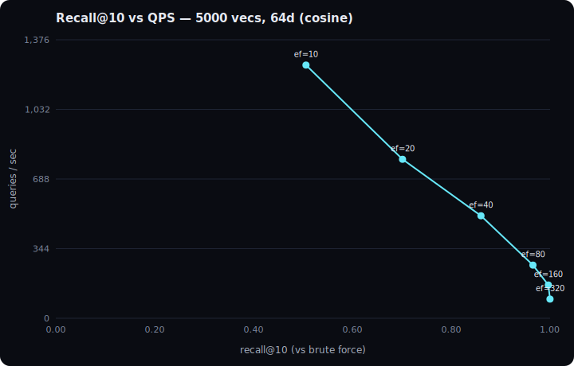

# Proxima

**A vector database built from scratch in Python** — a hand-rolled
[HNSW](https://arxiv.org/abs/1603.09320) approximate-nearest-neighbour index on
top of a durable SQLite store, wrapped in a FastAPI service, with a React UI that
shows search happening live inside a 2D map of the vector space. The index is
implemented by hand (no `faiss`/`hnswlib`/`annoy`); durability is delegated to
SQLite. The point of the project is to *understand and defend* every layer — why
HNSW works, why a graph beats a linear scan, and where the recall/latency
tradeoff lives.

---

## Architecture

```
   React UI  (Vite + TS + Tailwind)
   2D map · search playground · filters · live metrics · seed/clear
        │  HTTP (JSON)
        ▼
   FastAPI service  (proxima/api/server.py)
   collections · upsert · search · search_by_id · delete · metrics
   projection (PCA→2D) · demo seed/reset
        │
        ▼
   Database  (proxima/db.py) ── many named collections
        │
        ▼
   Collection  (proxima/collection.py)
   owns: dim + metric + the live index + a metadata cache
   ┌─────────────────────────────┐
   │  hand-rolled HNSW (in RAM)  │   index/hnsw.py   ← the centerpiece
   └─────────────────────────────┘
        │  rebuilt on startup from ↓
        ▼
   SQLite  (proxima/store.py)  ── the source of truth
   vectors as float32 BLOBs · metadata as JSON · one row per vector
```

**Core idea:** SQLite is authoritative and durable; the HNSW graph is an
in-memory *derived* structure, rebuilt (or loaded) from SQLite on startup. That
split is deliberate — engineering effort goes into the index, a proven embedded
DB owns crash-safety.

---

## Results — recall@10 vs QPS

Sweeping `ef_search` (the query-time breadth dial) against exact brute-force
ground truth. 5,000 synthetic 64-d vectors, 500 queries, cosine, `M=16`,
`ef_construction=200`:



| ef_search | recall@10 |   QPS | latency (ms) |
|----------:|----------:|------:|-------------:|
|        10 |     0.506 | 1,251 |        0.80  |
|        20 |     0.701 |   785 |        1.27  |
|        40 |     0.860 |   506 |        1.97  |
|        80 |     0.965 |   262 |        3.81  |
|       160 |     0.996 |   164 |        6.08  |
|       320 |     1.000 |    95 |       10.54  |

The classic ANN tradeoff: more search breadth buys recall and costs throughput.
Regenerate with `python -m bench.bench` (numbers vary by machine).

---

## The live UI

A search playground over the 2D vector space: click a node (or pick a title) to
find its nearest neighbours; the map highlights the query and draws links to its
kNN. Genre/studio filters post-filter the results and dim non-matching nodes.
Live metrics show recall@10, latency, QPS, and vector count. Seed/Clear buttons
populate and empty the map on screen.

> _Add a screenshot at `docs/ui.png` and it will render here:_
>
> ``

---

## Run it

**Backend + tests**

```bash
python -m venv venv
venv\Scripts\activate                 # Windows  (source venv/bin/activate elsewhere)
pip install -r requirements.txt

pytest                                # 95 tests across all layers
python -m scripts.seed --seed         # load the demo dataset into proxima.db
python -m uvicorn proxima.api.server:app --port 8000    # http://127.0.0.1:8000/docs
```

**UI**

```bash
cd ui
npm install
npm run dev                           # http://localhost:5173
```

Then click **Seed demo data** and start clicking nodes.

**Benchmark**

```bash
python -m bench.bench                                   # synthetic, default sweep
python -m bench.bench --base base.npy --query query.npy # bring your own (SIFT/GloVe)
```

---

## Design decisions & tradeoffs

- **Hand-rolled HNSW, library-backed everything else.** The index is the
  differentiator and the thing interviewers probe, so it's from scratch:
  probabilistic layer heights, a bounded `ef`-sized candidate heap, greedy
  descent through the layers. Distance math (`numpy`), persistence (`sqlite3`),
  the API (`fastapi`), and 2D projection (`scikit-learn` PCA) are libraries —
  re-implementing them would add no signal.

- **SQLite for persistence, not a custom format.** Durability, atomic commits,
  and crash recovery are solved problems. SQLite is the source of truth; the
  index is rebuilt from it. Vectors are stored as raw `float32` BLOBs (compact,
  exact, parse-free) and metadata as JSON (schema-flexible — arbitrary
  `{genre, year, studio}` with no migrations).

- **Post-filtering, stated honestly.** Metadata filters search the graph first,
  then drop non-matching results, over-fetching to compensate. A very selective
  filter can still starve the result set. The alternative (pre-filtering inside
  the graph walk) is harder to do well on HNSW and is out of scope.

- **Append-only index; delete = rebuild.** Removing a node from a proximity
  graph and repairing its neighbours' edges is error-prone. Since the index is
  derived and SQLite is authoritative, delete removes the row and rebuilds.
  O(n), but always consistent — fine at this scale.

- **Optional graph cache, validated by fingerprint.** With a `graph_dir` set,
  the serialized HNSW graph is loaded on startup instead of being rebuilt — but
  only if its content fingerprint (a hash of the `(id, vector)` pairs, excluding
  metadata) still matches the store. A stale cache is self-invalidating: on
  mismatch we just rebuild from SQLite. The graph is never authoritative.

- **Synthetic demo embeddings.** The demo dataset uses genre-centered
  pseudo-embeddings (seeded), not a real text model — guaranteed-visible
  clusters with no model download. Swapping in real sentence embeddings is a
  one-function change.

- **Distance, not similarity.** Every metric (cosine, L2, dot) is normalized to
  a *distance where smaller = nearer*, so the index never branches on metric.

---

## Layout

```
proxima/
  distance.py        cosine / l2 / dot, numpy-vectorized (smaller = nearer)
  bruteforce.py      exact linear-scan top-k — the recall ground truth
  store.py           SQLite persistence (float32 BLOBs + JSON metadata)
  index/hnsw.py      hand-rolled HNSW  ← the centerpiece
  collection.py      index + store + metadata-filtered search + metrics
  db.py              many collections, lazily rebuilt from SQLite
  projection.py      PCA → 2D for the UI map
  demo.py            clustered demo dataset + seed/reset
  api/server.py      FastAPI service
scripts/seed.py      CLI: --seed / --reset
bench/               recall@10 vs QPS harness (+ hand-rolled SVG curve)
tests/               pytest, one file per module (95 tests)
ui/                  React + Vite + TS + Tailwind demo
```

Built in phases; the index never depends on an ANN library, and the owner can
open any file and explain why each decision was made.
